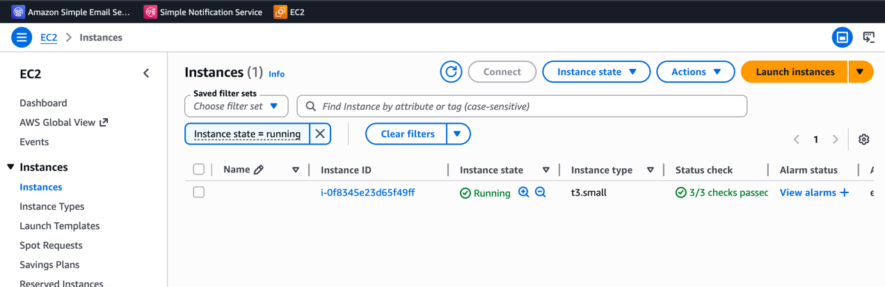
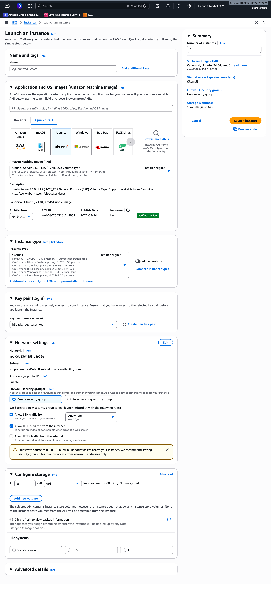
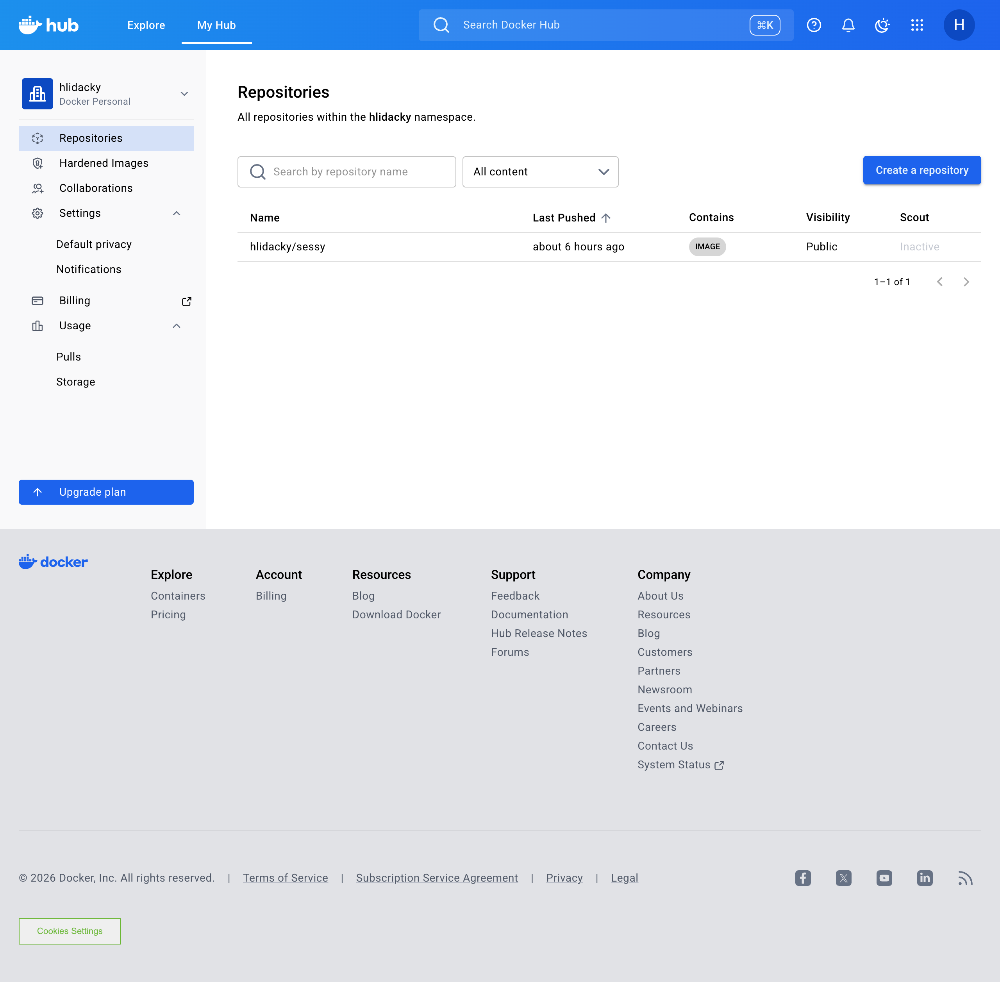
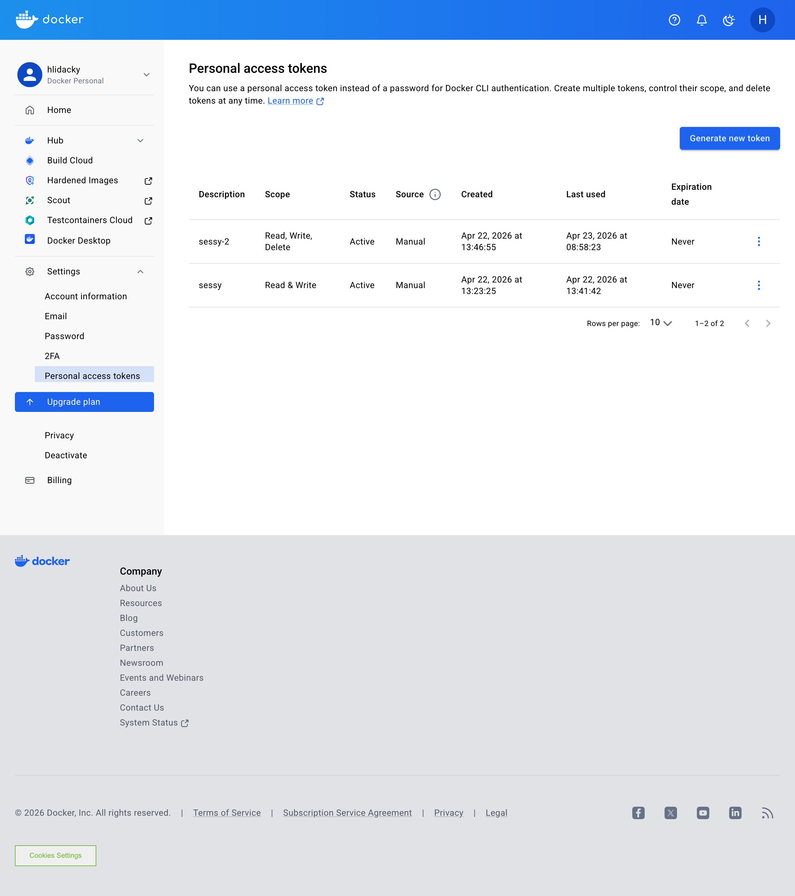

# Sessy Deployment Docs

1. Server Setup (AWS EC2) gets public IP
2. Copy credentials to the local .kamal/secrets file (see 1Password Docker)
3. 

This folder contains deployment guides for running Sessy on your own infrastructure.

| Guide | Description |
|-------|-------------|
| [kamal-deployment.md](kamal-deployment.md) | Deploy with Kamal 

---

## Current Kamal Setup (this branch)

This branch configures Kamal to deploy to an AWS EC2 instance. Below is a summary of the key decisions.

### Server AWS EC2

Launch an EC2 instance with **Ubuntu** AMI. The minimum recommended instance type is **t3.small** — the remote Docker image build (compiling Ruby gems and assets) requires enough RAM to complete reliably; t3.micro tends to OOM.



**Security group** must allow inbound:

| Port | Protocol | Source | Purpose |
|------|----------|--------|---------|
| 22 | TCP | your IP | SSH (Kamal deploys, remote builder) |
| 443 | TCP | 0.0.0.0/0 | HTTPS traffic |



**SSH key** — when launching the instance, AWS lets you create or select a key pair. Download the `.pem` file and place it in `~/.ssh/`. If you need to generate one manually:

```sh
# Generate a new key pair locally
ssh-keygen -t ed25519 -f ~/.ssh/hlidacky-dev-sessy-key.pem -C "sessy-deploy"

# Copy the public key to the server (first login only, using a temporary key or EC2 Instance Connect)
ssh-copy-id -i ~/.ssh/hlidacky-dev-sessy-key.pem.pub ubuntu@16.171.225.45

# Lock down permissions (required — SSH refuses keys readable by others)
chmod 600 ~/.ssh/hlidacky-dev-sessy-key.pem
```

The default Ubuntu AMI user is `ubuntu`, so SSH is configured accordingly:

```yaml
ssh:
  user: ubuntu
  keys:
    - ~/.ssh/hlidacky-dev-sessy-key.pem
```

### SSL

SSL is handled automatically by Kamal's proxy (kamal-proxy / Let's Encrypt) using [sslip.io](https://sslip.io) — a wildcard DNS service that resolves `<IP>.sslip.io` to the IP. No custom domain required.

```yaml
proxy:
  ssl: true
  host: 16.171.225.45.sslip.io
```

### Container Registry

Images are pushed to Docker Hub under the `hlidacky` account ([hub.docker.com/repositories/hlidacky](https://hub.docker.com/repositories/hlidacky)) in the public `hlidacky/sessy` repository.



Authentication uses a **Personal Access Token** (not the account password). The token is stored in **1Password** and exposed to Kamal via the `KAMAL_REGISTRY_PASSWORD` secret. The active token (`sessy-2`) has **Read, Write, Delete** scope — sufficient for Kamal to push new image layers and clean up old ones.



```yaml
registry:
  server: registry-1.docker.io
  username: hlidacky
  password:
    - KAMAL_REGISTRY_PASSWORD
```

Copy the token from 1Password and set it as `KAMAL_REGISTRY_PASSWORD` in `.kamal/secrets` — see the [Secrets](#secrets) section below.

### Remote Builder

Because the deployment target is `amd64` and development machines are Apple Silicon (`arm64`), the Docker image is built remotely on the EC2 server itself to avoid slow QEMU emulation:

```yaml
builder:
  arch: amd64
  remote: ssh://ubuntu@16.171.225.45
```

### Secrets

`.kamal/secrets` is gitignored and must be created locally before deploying. Copy the values from **1Password** and fill them in:

```sh
KAMAL_REGISTRY_PASSWORD=your_dockerhub_token   # 1Password: Docker Hub hlidacky → token
RAILS_MASTER_KEY=$(cat config/master.key)       # reads from config/master.key
HTTP_AUTH_USERNAME=admin
HTTP_AUTH_PASSWORD=your_secure_password         # 1Password: Sessy HTTP Auth → password
```

### Updating the server IP

When you launch a new EC2 instance (or the public IP changes), update the single `SERVER_IP` variable at the top of `config/deploy.yml`:

```erb
<% SERVER_IP = "16.171.225.45" %>
```

This one value is reused automatically in three places — the deploy target, the SSL host, and the remote builder:

```yaml
servers:
  web:
    - <%= SERVER_IP %>

proxy:
  host: <%= SERVER_IP %>.sslip.io

builder:
  remote: ssh://ubuntu@<%= SERVER_IP %>
```

### Deploy

```sh
bin/kamal setup    # first time
bin/kamal deploy   # subsequent deployments
```

### Open browser
[https://16.171.225.45.sslip.io](https://16.171.225.45.sslip.io)
